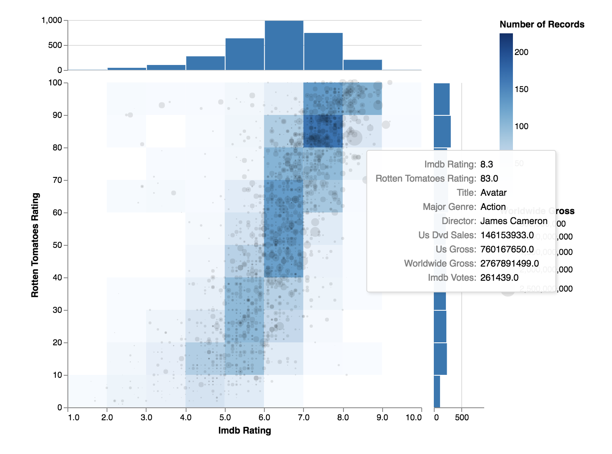

# Vega for Looker

This page will contain a collection of Vega visuals ported for Looker.
https://vega.github.io/vega/

If you are looking to leverage vega capabilities in a more self-service manner, see 
https://github.com/groodlooker/vega-lite.

The following dependencies are required for all charts leveraging vega:

https://cdn.jsdelivr.net/npm/vega@4.3.0

https://cdn.jsdelivr.net/npm/vega-lite@2.6.0

https://cdn.jsdelivr.net/npm/vega-embed@3.20.0

# 1. Contour Plot
From Vega, "A contour plot depicts the density of data points using a set of discrete levels. Akin to contour lines on topographic maps, each contour boundary is an isoline of constant density. Kernel density estimation is performed to generate a continuous approximation of the sample density. Vega uses the d3-contour module to perform density estimation and generate contours in the form of GeoJSON polygons."

# 2. Binned Scatter Plot with Histogram

